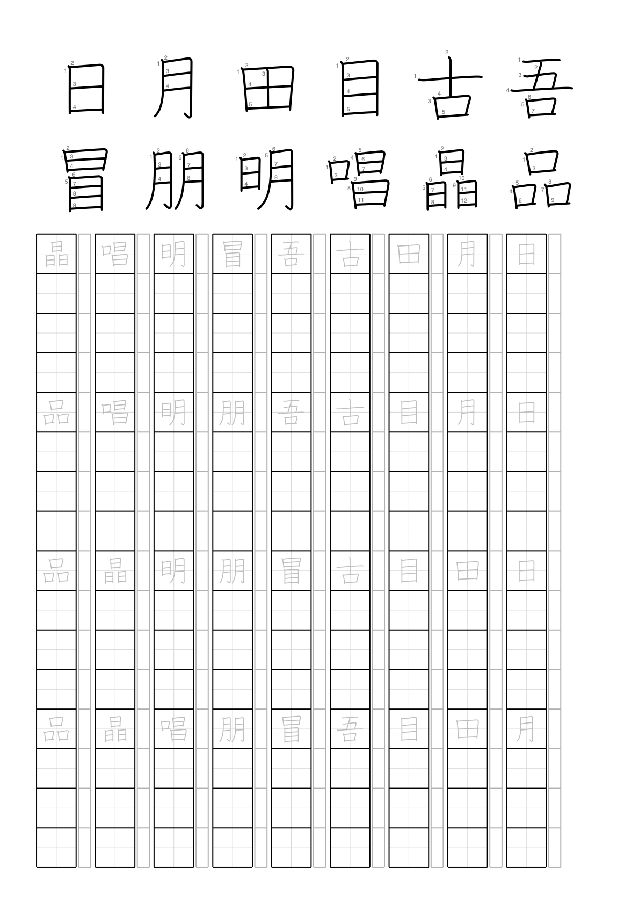

Japanese worksheets
===================

A small Python appliction to create Japanese worksheet PDFs like [this](example.pdf).



Install
-------

```
$ git clone git@github.com:george-hawkins/japanese-worksheets.git
$ cd japanese-worksheets
$ python3 -m venv venv
$ source venv/bin/activate
(venv) $ pip install --upgrade pip
(venv) $ pip install reportlab requests lxml svglib
```

Run
---

```
(venv) $ python worksheet.py --filename=example.pdf --characters='日月田目古吾冒朋明唱晶品'
```
